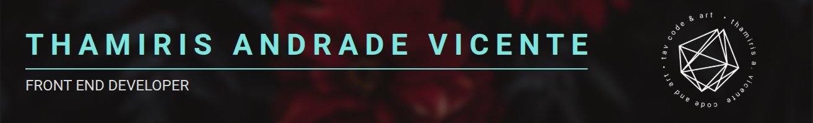

  
  

# Hi! I am Thami,
a brazillian front-end developer based in Veldhoven. Over the past 4 years, I’ve gained solid experience with Vue.js and CMS platforms such as Adobe Experience Manager, developing not only strong programming skills but also knowledge in team management and accessibility. Additionally, my background in design has given me a strong foundation in user experience and business thinking. My key soft skills include commitment, fast learning ability, and adaptability.

## :technologist: [See projects](https://gist.github.com/thamiavicente/d24ec39d380896e03a22896ae4a55c8f)

<table>
  <tr>
    <td rowspan="5">
      
    </td>
    <td>
      
    </td>
  <tr>
  <tr>
    <td>
      
    </td>
  </tr>
  <tr>
    <td>
      
    </td>
  </tr>
  <tr>
    <td>
      
    </td>
  </tr>
</table>

## :rocket: [website](https://thamiavicente-github-io.vercel.app) | :necktie: [Linkedin](https://www.linkedin.com/in/thamiavicente/) | :memo: [Medium](https://medium.com/@thamiavicente) | :email: [thamiavicente@gmail.com](mailto:thamiavicente@gmail.com)